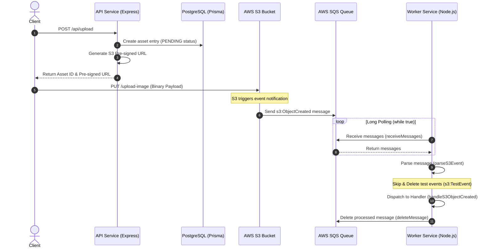

# SQS and Worker Integration Documentation

This document explains the asynchronous processing architecture of CloudPix, specifically detailing the integration between SQS, S3, the API upload pipeline, and the background Worker service.

---

## 1. Architecture Overview

CloudPix uses an event-driven, decoupled architecture to process assets asynchronously:

---

## 2. API Upload Pipeline

### Upload Controller
The controller [[upload.controller.ts](file:///Ubuntu/home/ashutosh/projects/Imagica/apps/api/src/controllers/upload.controller.ts)] handles the upload initiation request:
* Validates user inputs.
* Requests a new S3 pre-signed upload URL from the service.
* Persists the metadata in the database via the Repository layer.

### Upload Service
The [[upload.service.ts](file:///Ubuntu/home/ashutosh/projects/Imagica/apps/api/src/services/upload.service.ts)] communicates with the AWS package to generate the pre-signed URL for the asset's original file key.

### Asset Repository
The [[asset.repository.ts](file:///Ubuntu/home/ashutosh/projects/Imagica/packages/database/src/repositories/asset.repository.ts)] abstracts database actions using Prisma client to create, read, and update assets in PostgreSQL.

---

## 3. Worker and SQS Integration

The background Worker service runs as a daemon process dedicated to handling heavy background compute jobs.

### Message Polling Loop
The main entry point [[worker.ts](file:///Ubuntu/home/ashutosh/projects/Imagica/apps/worker/src/worker.ts)] executes a continuous `while (true)` loop:
1. Long-polls for new messages from SQS using `receiveMessages()`.
2. For each message:
   - Parses the body into an S3 event.
   - If it's a test event (`s3:TestEvent`), it immediately deletes it from the queue and continues.
   - For valid object creation events, it dispatches them to the handler (`handleS3ObjectCreated`).
   - Deletes the message from the queue after successful execution.

### AWS SQS Service Wrapper
The SQS interactions are abstracted inside [[sqs.service.ts](file:///Ubuntu/home/ashutosh/projects/Imagica/packages/aws/src/services/sqs.service.ts)]:
* `receiveMessages()` uses `@aws-sdk/client-sqs` to long-poll SQS messages with a visibility timeout and maximum message batching.
* `deleteMessage()` clears the processed message from the queue by its receipt handle.

### S3 Event Parser
The parser [[parser.ts](file:///Ubuntu/home/ashutosh/projects/Imagica/packages/shared/src/events/parser.ts)] safely processes raw JSON strings into structured event data:
* **Test Event Filtering:** Safely filters out initial `s3:TestEvent` notifications generated by S3 bucket setup/connection tests without crashing.
* **Extraction:** Parses standard S3 records, returning clean bucket name, decoded object key, and event timestamp in the type `S3ObjectCreatedEvent`.

### Event Handler
The handler [[s3-object-created.handler.ts](file:///Ubuntu/home/ashutosh/projects/Imagica/apps/worker/src/handlers/s3-object-created.handler.ts)] defines the workflow triggered when S3 notifies that an asset upload is complete (currently logging the metadata in preparation for image processing jobs).
